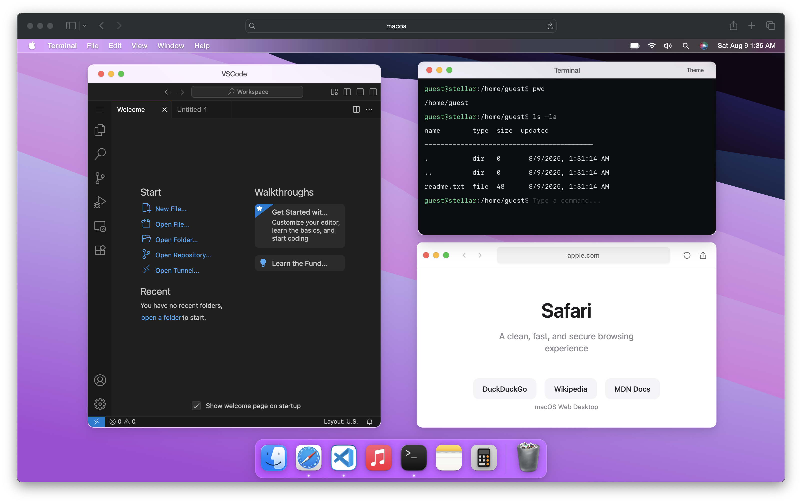

## MacScape

<p align="center">
  
</p>

<p align="center">
  <a href="#"></a>
  <a href="#"></a>
  <a href="#"></a>
</p>

A minimal macOS‑style desktop built with Next.js + React. It includes a window manager, Dock, Top Bar, a desktop context menu, and several demo apps (Notes, Terminal, Safari, VSCode, Music, Calculator).

### Why
- **KISS + YAGNI**: simple state, straightforward components
- **Pure Next.js**: no backend, no DB, no heavy state libraries
- **Small helpers**: only where they earn their keep

### Features
- **Windows**: move, resize, minimize, maximize, focus with z‑index, smooth animations
- **Dock**: launch apps; running indicators
- **Top Bar**: app title, date/time, and mock controls
- **Desktop**: selection frame and right‑click context menu
- **Keyboard friendly**: common keys in Terminal and Calculator
- **No server**: fully client‑side demo

### Included apps
- **Notes**: minimal editor (placeholder)
- **Terminal**: in‑browser shell with a small in‑memory FS
- **Safari**: simple browser mock landing page
- **VSCode**: static mock UI
- **Music**: static mock UI
- **Calculator**: macOS‑style keypad with live expression view

### Quick start
- Install: `npm install`
- Dev: `npm run dev`
- Build: `npm run build`
- Start: `npm start`

Requires Node 18.18+ (or Node 20+) for Next.js 15.

### Keyboard shortcuts
- **Calculator**
  - Digits: `0-9`
  - Decimal: `.`
  - Ops: `+`, `-`, `*`, `/`
  - Equals: `Enter` or `=`
  - Clear: `c`
  - Percent: `%`
  - Toggle sign: `+/-` button
- **Terminal**
  - Run command: `Enter`
  - History: `ArrowUp` / `ArrowDown`
  - Clear screen: `Ctrl+L` or `Cmd+L`
  - Abort running command: `Ctrl+C` or `Cmd+C`
  - Autocomplete: `Tab`

- **Windows**
  - Double‑click window header: toggle maximize
  - Option/Alt + double‑click header: minimize

### Project structure
- `src/context/WindowManagerContext.tsx` - window lifecycle and z‑index
- `src/components/Desktop.tsx` - desktop surface and context menu
- `src/components/Dock/` - dock UI and app launcher (`Dock.tsx`, `dockConfig.ts`)
- `src/components/Window/Window.tsx` - window frame, drag/resize/maximize
- `src/components/AppViews/` - built‑in demo apps (Notes, Terminal, Safari, VSCode, Music, Calculator)

### Add an app to the Dock
1) Create your app component under `src/components/AppViews/`.
2) Add an entry to `src/components/Dock/dockConfig.ts` under `dockApps`:

```ts
{
  id: 'myapp',
  name: 'My App',
  iconPath: '/AppIcons/myapp.png',
  component: MyApp,
  defaultPosition: { x: 120, y: 120 },
  defaultSize: { width: 800, height: 600 },
}
```

### Deployment
- **Vercel**: standard Next.js project → import, build, deploy
- **Cloudflare Pages**: `npm run build` then `npm run pages:deploy` (uses the included script)

### Notes on assets
The UI mimics macOS visuals for educational/demo purposes. Avoid redistributing Apple‑owned icons/logos in production. Replace with your own assets or open‑licensed alternatives where necessary.

### License
MIT

- PRs to improve accessibility, keyboard support, and more demo apps are welcome!
